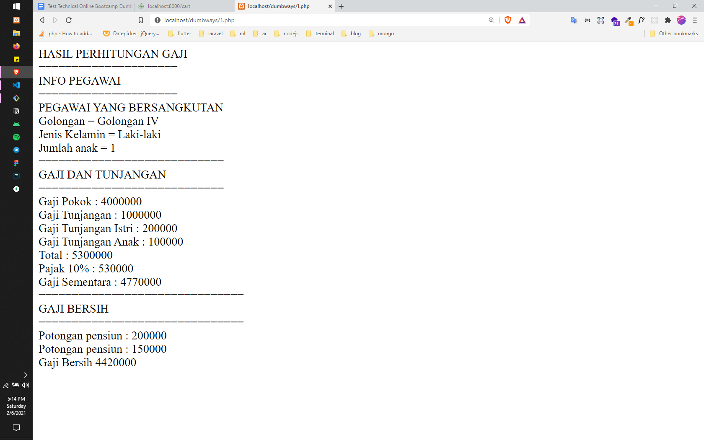
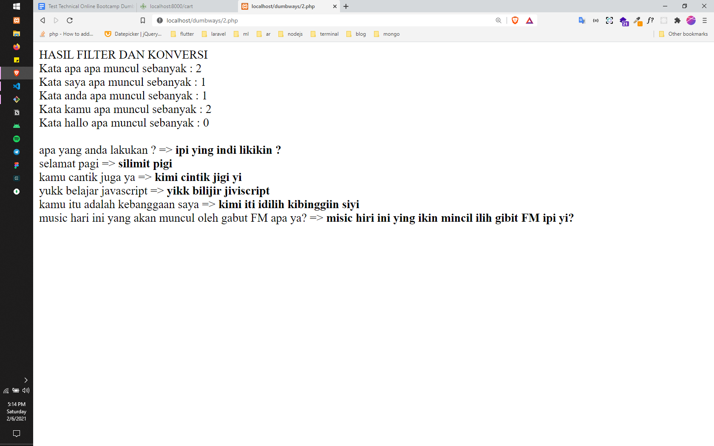
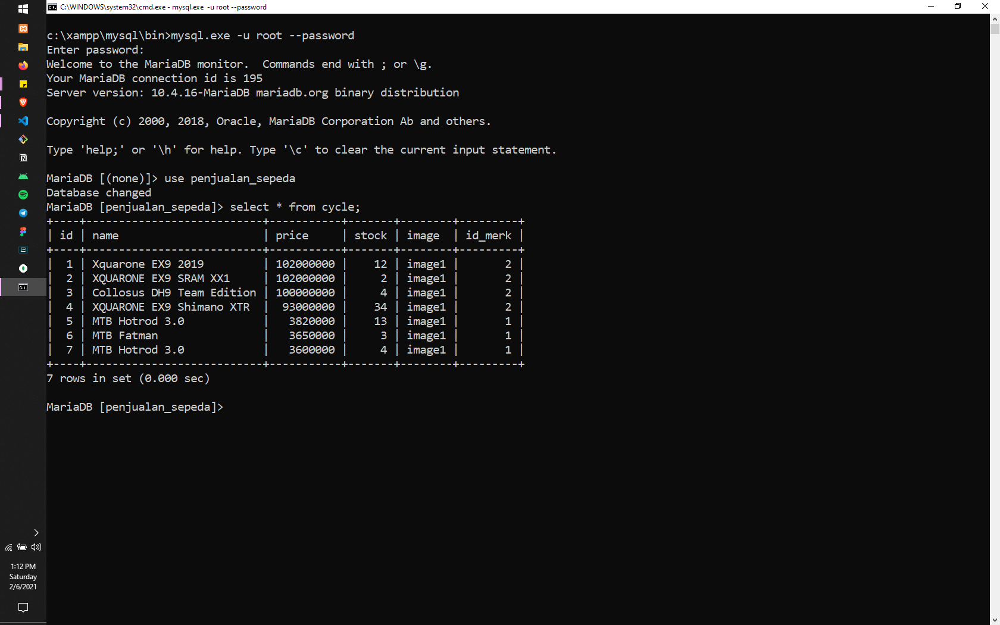
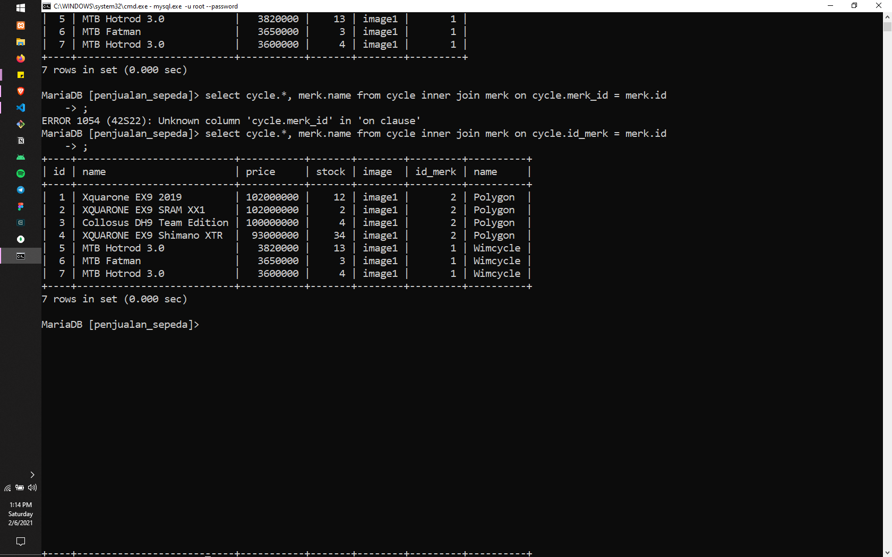
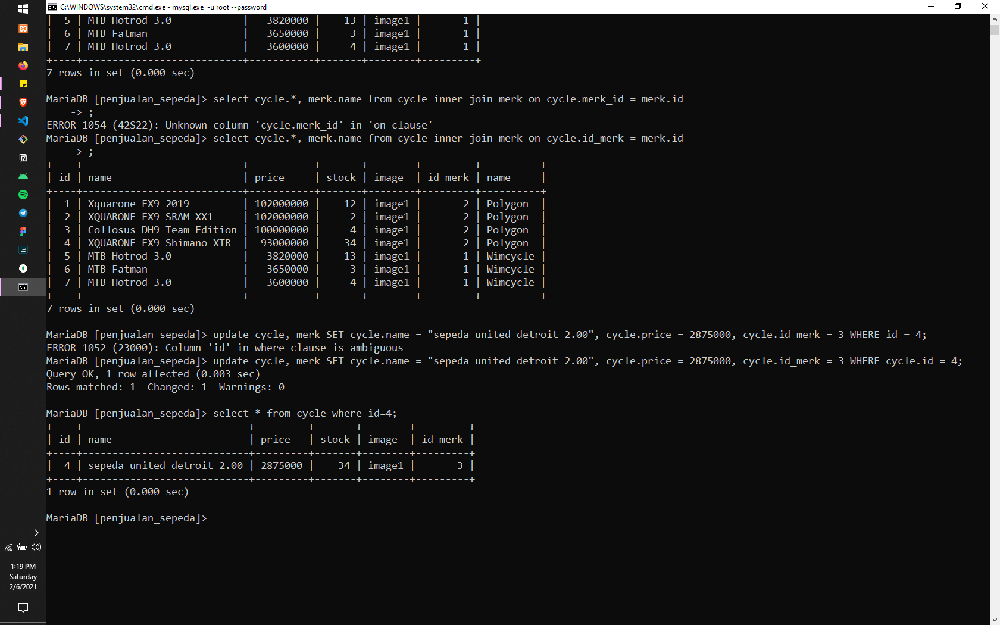
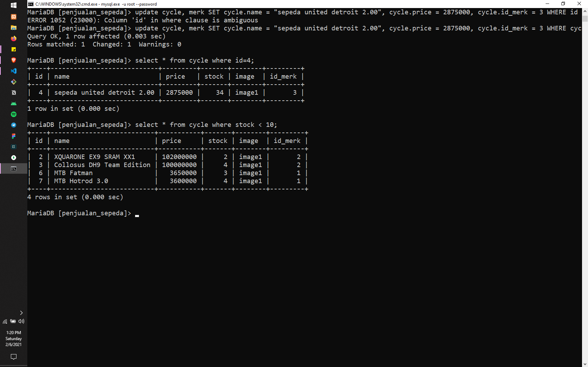
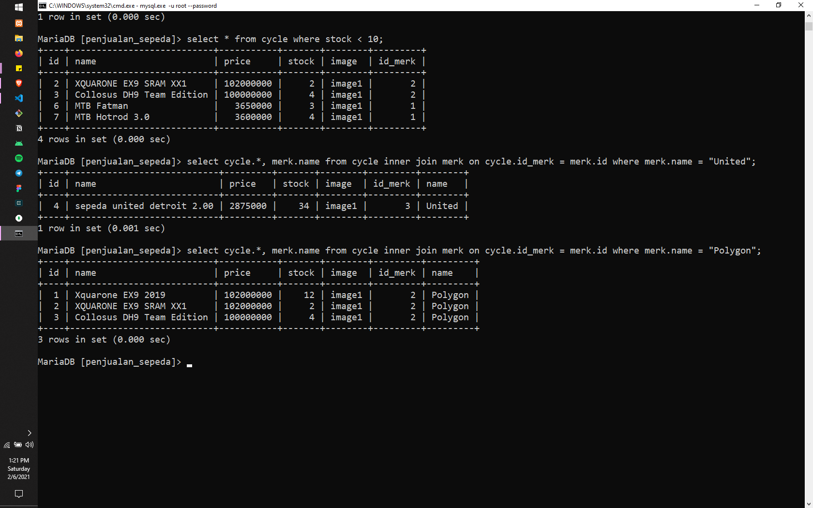
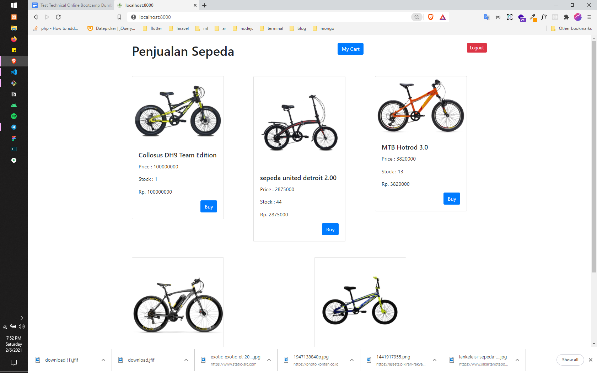
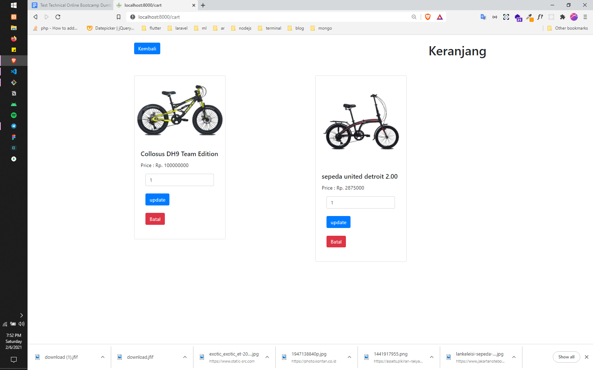

# test technical dumbways

- bahasa yang digunakan adalah **php** dan framework  **laravel**

## SOAL 1

## SOAL 2

## SOAL 3

## SOAL 4

### Database
- tampilkan semua data pada tabel sepeda

- tampilkan detail data sepeda

- edit 1 sepeda beserta merk

- Tampilkan seluruh data sepeda berdasarkan stock tertentu

- Tampilkan seluruh data sepeda berdasarkan merk tertentu

### Home

### Order
